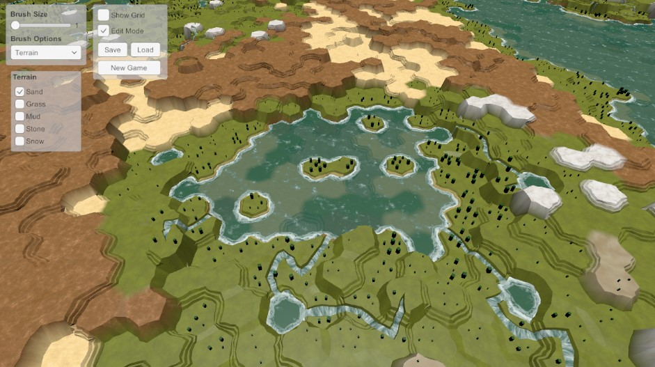

# Hex Map Tutorials

Built following the hex series of tutorials written by Catlike Coding: https://catlikecoding.com/unity/tutorials/hex-map

The final work looks like this:

This is in edit mode - fog of war is also implemented, as are everything in the 27 tutorials. No doubt some bugs somewhere, but primarily the only deviation is minor aspects of coding style.